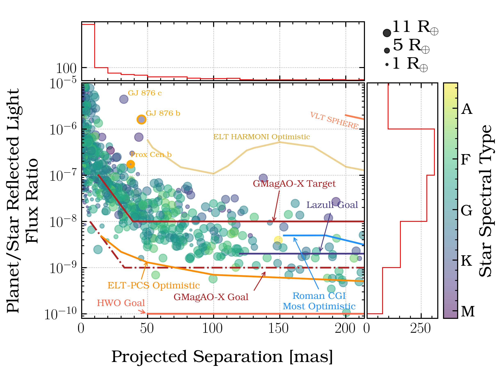

# Known planets in reflected light Lambertain contrast vs. maximum projected separation with instrument contrast curves

This repo produces a publication-quality plot of known planets in reflected light as seen in GRIP [https://getagrip.streamlit.app/](https://getagrip.streamlit.app/) and [Pearce, Males, and Limbach 2025](https://ui.adsabs.harvard.edu/abs/2025PASP..137i4401P/abstract) Fig 2. Many of the contrast curves are retrieved from Vanessa Bailey's [DI flux ratio plot](https://github.com/nasavbailey/DI-flux-ratio-plot) and included in this repo, as well as current and anticipated constrast curves for various space and groudbased platforms (the source is noted in the notebook).

The planets included in the plot are updated semi-regularly as new planets are added to the Exoplanet Archive. Planet parameters are retrieved from the the Exoplanet Archive, and properties plotted here are documented [here](https://getagrip.streamlit.app/Derivation) (which is also a notebook that can be downloaded and reproduced). 

### python requirements
* python 3 (only tested up to 3.12)
* matplotlib
* astropy (ascii, units)
* numpy
* jupyter notebook

## Making and customizing a plot

Simply clone this repo to download all required files and jupyter notebook for producing the plot. By default the notebook: 
1. plots all known planets with sufficient information in Lambertian contrast (assuming uniform A_g = 0.45) vs. maximum projected separation in mas, color coded by host star spectral type, and marker size corresponding to estimated radius; 
2. highlights three planets relevant to ground-based reflected light campaigns, GJ 876 b and c and Proxima Centauri b; 
3. plots contrast curves for Roman CGI most optimistic, Lazuli, HWO, VLT Sphere, ELT-Harmoni, GMagAO-X target and goal, and ELT-PCS for a G2 type star. The repo also contains curves for VLT Gravity, HST-STIS, and ELT-PCS for an M3 type star.

There are a lot more parameters in the planets .csv file that be plotted by changing the column name in the `plotx` and `ploty` parameter. You can turn off highlighting the selected planets by commenting those lines, or select different planets to highlight by selecting the names from the planet .csv file in the first few rows of the plot cell. You can turn off and on the contrast cuves to plot by setting the keyword to false (Ex: to turn off Roman contrast curve set `plot_roman_curve = False`).

Any questions or suggestions please email me at lapearce@umich.edu.

## Change log
#### 2026-07-17
* Initial commit. Exoplanets retrieved 2026-05-21